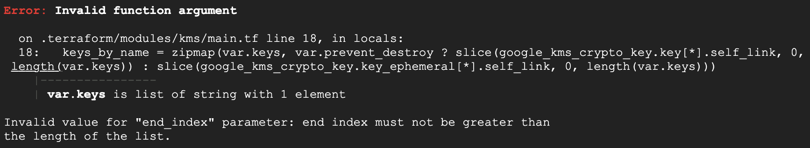

# GKE Cluster Deployments

* [Before you begin](#before-you-begin)
* [Deploying the GKE cluster](#deploying-the-gke-cluster)
* [Validate GKE cluster config](#validate-gke-cluster-config)
* [Next steps](#next-steps)
* [Cleaning up](#cleaning-up)

## Before you begin

The scripts provided in this repository require the existence of a `cluster_config` file in the root directory. This config file contains a baseline set of variables, including the GCP Region, Zone and Project ID to be used when creating the GKE cluster. A template of this configuration file named [cluster_config.example](../scripts/cluster_config.example) can be found in the scripts directory. Please create a copy of this file in the root directory, rename to `cluster_config` and modify as needed.

>**NOTE:** If a `cluster_config` file is not detected in the root, the script will attempt to create one for you with the default values set. By default, these values will deploy a Private GKE cluster with a default linux nodepool in a standalone VPC. 

The section below outlines the required and optional configuration settings.

## GKE Cluster Creation Values

Default values for required information have be populated to use the current configuration of the Google Cloud SDK, during cluster deployment. If you need to deploy the GKE cluster in a region, zone or project that is different than your current Google Cloud SDK configuration information, update the following settings in the `cluster_config` file:

### Required Settings

| Setting | Description| Default Value|
|:-|:-|:-| 
|REGION |Target compute region for GKE|`gcloud config get-value compute/region` |
|ZONE| Target compute zone for bastion host| `gcloud config get-value compute/zone`|
|PROJECT| GCP Project to use| `gcloud config get-value project`|

>**NOTE:** If using the default `gcloud` values, please verify they have been set before moving forward or you will receive an error the first time you attempt to deploy. 

### Optional Settings

Included in the `cluster_config` configuration file are options for Shared VPC configurations, GKE Cluster Node Pools with Windows nodes,  pre-emptible node configurations, and GKE control plane access configurations. In the sections below, the available optional settings and their default values are described. Update the `cluster_config` file as needed to use these additional features.

**[Public Endpoint Cluster](https://cloud.google.com/kubernetes-engine/docs/how-to/authorized-networks)** 

The default deployment limits GKE control plane access to the bastion host subnet in the GKE VPC. Enabling the following configuration setting will grant control plane access to the public endpoint of the deployment device. The bastion host will not be deployed if this option is selected. If you choose this deployment option, please use [Deploy a GKE Cluster with Public endpoint](#deploy-a-gke-cluster-with-public-endpoint) for deployment next steps. 

| Setting | Description| Default Value|
|:-|:-|:-|
PUBLIC_CLUSTER||false|

**[Consolidate Logging and Security](https://cloud.google.com/docs/enterprise/best-practices-for-enterprise-organizations#centralization)**

A common practice for security conscious customers is to consolidate logging, monitoring and security resources in projects managed by the security team and applying least priviledge permissions. By default, this deployment reuses the GKE Project to host the KVM and log sinks. If you'd like to host these resources in a separate governance specific project, provide a different project name for `GOVERNANCE_PROJECT`.

| Setting | Description| Default Value|
|:-|:-|:-|
|GOVERNANCE_PROJECT| GCP Project used for KVM, Log Sinks and Governance|`gcloud config get-value project`|

**[Windows Node Pool](https://cloud.google.com/kubernetes-engine/docs/concepts/windows-server-gke)**

The default deployment limits the GKE cluster deploys a linux node pool. Enabling the following configuration setting will deploy an additional Windows node pool for deploying Windows Server container workloads. 

| setting | Description| Default Value|
|:-|:-|:-|
WINDOWS_CLUSTER||false|

**[Preemptible Nodes](https://cloud.google.com/kubernetes-engine/docs/how-to/preemptible-vms)** 

The default deployment limits the GKE cluster to non-preemptible nodes which cannot be reclaimed while in use. Enabling the following configuration setting will deploy the cluster with preemptible nodes that last a maximum of 24 hours and provide no availability guarentees.

| setting | Description| Default Value|
|:-|:-|:-|
PREEMPTIBLE_NODES||false|

**[Shared VPC](https://cloud.google.com/vpc/docs/shared-vpc)**

The default deployment deploys to a standalone VPC in the project where the cluster is created. Enabling the following configuration settings will deploy the GKE cluster to a shared VPC in a Host Project of your choice.

>**NOTE:** Deploying multiple GKE Toolkit environments to the same Shared VPC is not currently supported. This feature will be added in the future. 

**The following pre-requisites must be completed prior to running the deployment if a Shared VPC is chosen**

* A Shared VPC in a Host Project must exist before deploying the GKE cluster(s). That VPC must meet the following prerequisites:
  * Two secondary IP ranges must be created on the target shared VPC subnet and configured with the pod and service IP CIDR ranges.
    * Example:
      * pod-ip-range       10.1.64.0/18
      * service-ip-range   10.2.64.0/18
  * The Service Project must be attached to the Shared VPC and the target subnet must be shared and in the deployment region. 
  * Kubernetes Engine Access must be enabled on the shared subnet.

>**NOTE:** Optionally, you can run `make shared-vpc` to automate the deployment of the Shared VPC in an existing Host Project. Shared VPC Admin permissions are required to perform that step.

| Setting | Description| Default Value|
|:-|:-|:-| 
|SHARED_VPC||false|
|SHARED_VPC_PROJECT_ID|Shared VPC project ID||
|SHARED_VPC_NAME|The Shared VPC name||
|SHARED_VPC_SUBNET_NAME|The name of the shared VPC subnet name||
|POD_IP_RANGE_NAME|The name of the secondary IP range used for cluster pod IPs||
|SERVICE_IP_RANGE_NAME|The name of the secondary IP range used for cluster services||


## Deploying the GKE cluster

The code in the `scripts` directory generates and populates terraform variable information and creates the following resources in the region, zone, and project specified:

* GKE Cluster 
  * A least privileged Google Service Account assigned to compute engine instances
  * [Workload Identity](https://cloud.google.com/kubernetes-engine/docs/how-to/workload-identity) enabled 
  * [Master Authorized Networks](https://cloud.google.com/kubernetes-engine/docs/how-to/authorized-networks) enabled - Limits GKE Control Plane access to specific IPs
  * [Application Layer Secrets](https://cloud.google.com/kubernetes-engine/docs/how-to/encrypting-secrets) enabled - Added encryption for sensitive GKE resources
  * [Kubernetes Config Connector](https://cloud.google.com/config-connector/docs/overview) enabled - Manage GCP resourcs through GKE

* Network resources
  * Firewall rules
  * Cloud NAT - provide outbound internet access for the clusters
  * Cloud Routers

* Cloud KMS
  * Key ring for storing the key encryption key (KEK) used for Application Layer Secrets 

* Variable settings
  * If `SHARED_VPC=false` a standaone VPC w/ subnets will also be created in the GKE project for hosting the GKE Agent Nodes and Bastion Host (if needed)
  * If `PUBLIC_CLUSTER=false` a Compute Engine Instance will deployed as a bastion host and mapped to the GKE Cluster's Master Authorized Network

### GKE Cluster Deployment Steps

If you are deploying a **Private Endpoint Cluster** (ie. `PUBLIC_CLUSTER=false`) then proceed to the next section. 

Otherwise, if you are deploying a **Public Endpoint Cluster** (ie. `PUBLIC_CLUSTER=true`), please skip to the following section for [steps on how to deploy a GKE Cluster with Public Endpoints](#steps-for-deploying-a-gke-cluster-with-public-endpoints). 

#### Steps for deploying a GKE Cluster with Private Endpoints

If choosing `PUBLIC_CLUSTER=false` the cluster will deploy with both private nodes and a private control plane node. To administer the cluster, a Linux Compute Engine instance will be deployed in the subnet with the GKE Agent Nodes and it's internal IP address will be mapped to the GKE Cluster's Master Authorized Network.

First, [clone the repository](https://docs.github.com/en/github/creating-cloning-and-archiving-repositories/cloning-a-repository-from-github/cloning-a-repository).

In the root of the cloned repository, there is a script to create the cluster:

```shell
# Create cluster 
#   - Expected Deployment Time:
#     - Linux - Approximately 10 minutes with default n1-standard-2 nodes
#     - Windows - Approximately 40 minutes with default n1-standard-4 nodes
#   - Expected output 
#     - Apply complete! Resources: XX added, 0 changed, 0 destroyed
make create
```  

Once the GKE cluster has been created, establish an SSH tunnel to the bastion:

```shell
make start-proxy
```

When the deployment is complete, retrieve the kubernetes config for the cluster, then set the `HTTPS_PROXY` environment variable to validate you can forward kubectl commands through the tunnel and manage the GKE cluster:

```shell
GKE_NAME=$(gcloud container clusters list --format="value(NAME)")
GKE_LOCATION=$(gcloud container clusters list --format="value(LOCATION)")

gcloud container clusters get-credentials $GKE_NAME --region $GKE_LOCATION

HTTPS_PROXY=localhost:8888 kubectl get ns
```

Stopping the SSH Tunnel:

```shell
make stop-proxy
```

Proceed to [validation steps](#additional-validation-of-the-gke-cluster-config) once installation completes. 

#### Steps for deploying a GKE Cluster with Public Endpoints

If choosing `PUBLIC_CLUSTER=true` the cluster will deploy with control plane nodes accessible from the public internet. In order to limit access to the control plane nodes, the public IP address used for running this deployment will be stored as `AUTH_IP` and mapped to the GKE Cluster's Master Authorized Network.

>**NOTE:** To change the client that can administer the cluster, update the setting for `AUTH_IP`. 

First, [clone the repository](https://docs.github.com/en/github/creating-cloning-and-archiving-repositories/cloning-a-repository-from-github/cloning-a-repository).

In the root of the cloned repository, there is a script to create the cluster:

```shell
# Create cluster 
#   - Expected Deployment Time:
#     - Linux - Approximately 10 minutes with default n1-standard-2 nodes
#     - Windows - Approximately 40 minutes with default n1-standard-4 nodes
#   - Expected output 
#     - Apply complete! Resources: XX added, 0 changed, 0 destroyed
make create
```

When the deployment is complete, retrieve the kubernetes config for the cluster to validate you can manage the GKE cluster:

```shell
GKE_NAME=$(gcloud container clusters list --format="value(NAME)")
GKE_LOCATION=$(gcloud container clusters list --format="value(LOCATION)")

gcloud container clusters get-credentials $GKE_NAME --region $GKE_LOCATION

kubectl get ns
```

Proceed to [validation steps](#additional-validation-of-the-gke-cluster-config) once installation completes. 

## Additional Validation of the GKE Cluster Config

For additional validation of the cluster's overall health and configuration, perform the following steps after the GKE cluster has completed its initial deployment. 

Proceed to [Next Steps](#next-steps) if you'd like to skip this step and move on to hardening the GKE Cluster.

### Kubernetes App Layer Secrets Validation

Execute the following command to retrieve the kubernetes config for the GKE Cluster:

```shell
GKE_NAME=$(gcloud container clusters list --format="value(NAME)")
GKE_LOCATION=$(gcloud container clusters list --format="value(LOCATION)")

gcloud container clusters get-credentials $GKE_NAME --region $GKE_LOCATION
```

The following command validates that Application-layer Secrets Encryption is enabled. If the cluster is using app secrets, the response contains an EncryptionConfig of `ENCRYPTED`:

```shell
gcloud container clusters describe $GKE_NAME \
  --region $GKE_LOCATION \
  --format 'value(databaseEncryption)' \
  --project $PROJECT

```

### GKE Cluster with Windows Nodepool Validation (If Windows Node Pools were selected)

Execute the following command to retrieve the kubernetes config for the cluster:

```shell
GKE_NAME=$(gcloud container clusters list --format="value(NAME)")
GKE_LOCATION=$(gcloud container clusters list --format="value(LOCATION)")

gcloud container clusters get-credentials $GKE_NAME --region $GKE_LOCATION
```

Validate Windows Server Node pool has been created:

```shell
kubectl get nodes --label-columns beta.kubernetes.io/os
```

## Next Steps

The next step is to futher harden the newly created cluster.

[GKE Hardening Instructions](SECURITY.md)

### Check the [FAQ](FAQ.md) if you run into issues with the build.

## Cleaning up

Running the command below will destroy all resources with the exception of the Cloud KMS, Key Rings and Keys created by this deployment. Futher deployments will create a new key ring and keys for use by the cluster. This is due to a feature in Cloud KMS requiring a [24 hour scheduled deletion of keys](https://cloud.google.com/kms/docs/faq#cannot_delete). Because of this, it is recommended to manually schedule the deletion of key rings and keys created while testing this deployment. 

```shell
make destroy

```

NOTE: Cloud KMS resources are removed from terraform state resulting in the following error when executing a `terraform destroy`. This error can be safely ignored: 


